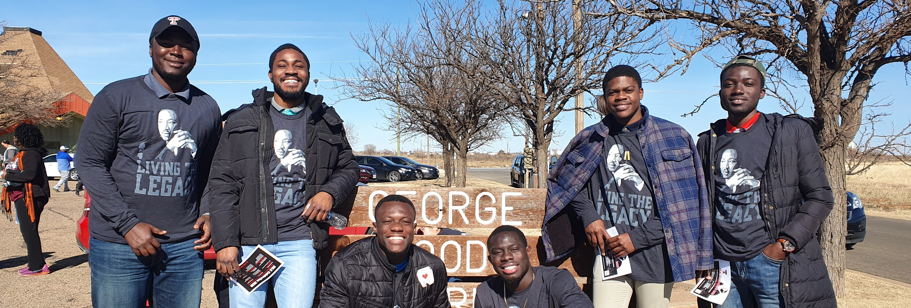

  

  

- 👋 Hi, I’m Kodjo Opoku Botchway
<!--- 👀 I’m interested in --->
- 🌱 I’m currently pursuing a Master's Degree in Business Analytics and Data Science at Oklahoma State University.
- 🌟 Professional Summary: Data engineer and energy engineer with a history of driving excellence on both sides of an analytical team. My research and professional experience have given me the ability to work and perform effectively in a team setting, whether as a leader or a supportive member. Possess the analytical and statistical abilities required to explore and solve business challenges, manage a wide range of expectations, and meet targets to the highest possible standard.

- 📫 How to reach me  
<a href = "https://www.linkedin.com/in/kodjo-botchway/"> LinkedIn </a>  
<a href = "mailto:botchwaykodjo@gmail.com"> Email </a>  

<!---
KodjoBotchway/KodjoBotchway is a ✨ special ✨ repository because its `README.md` (this file) appears on your GitHub profile.
--->
